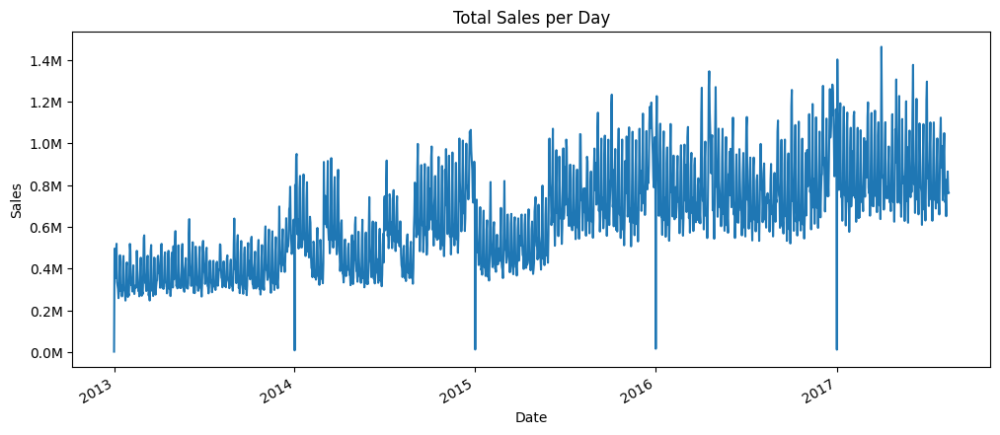
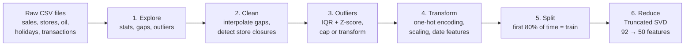
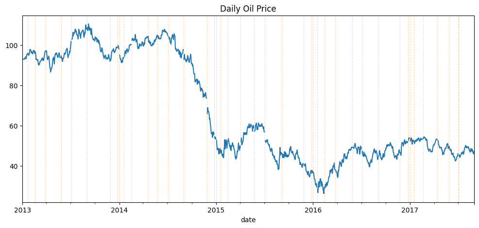
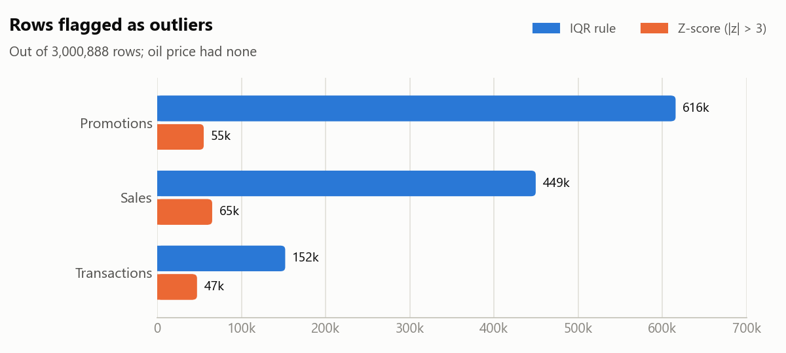
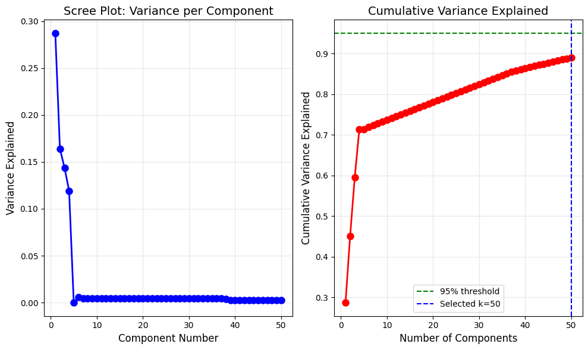

# Retail Data Preprocessing Pipeline


Real-world sales data is messy: days are missing, stores close, holidays and promotions create huge spikes.
This project turns the raw **Favorita store-sales data** (a supermarket chain in Ecuador) into a clean,
model-ready dataset, step by step, with every decision explained.



## At a glance

| | |
|---|---|
| **Data** | 3,000,888 daily sales records · 54 stores · 33 product families · Jan 2013 – Aug 2017 |
| **Extra sources merged** | store details, daily transactions, oil prices, national/regional/local holidays |
| **Output** | cleaned table, engineered features, 80/20 time-based split, 92 → 50 features with Truncated SVD |
| **Context** | NTNU course IT3212, Autumn 2025, group project |

## Pipeline



### 1. Explore
Summary statistics, data types and missing values for every file, plus sales and transaction trends over time.

### 2. Clean missing data
- **Oil prices:** 43 missing days, filled with spline interpolation, since prices move smoothly over time.
- **Transactions:** a full daily calendar is built for every store. Gaps of 10+ days are treated as the store being
  **closed** (transactions = 0); short gaps (≤ 5 days) on normal open days are filled with time-based interpolation.
- **Holidays:** a per-store `is_holiday` flag combines national, regional (same state) and local (same city) holidays,
  and handles transferred holidays correctly.



### 3. Handle outliers
Outliers are detected with two methods, then handled per column instead of being deleted, because most spikes are
real (holidays, promotions):

<picture>
  <source media="(prefers-color-scheme: dark)" srcset="images/outliers-dark.png">
  
</picture>

| Column | Decision |
|---|---|
| `sales` | keep the real peaks, add a `log1p` version to reduce skew |
| `onpromotion` | cap at the 99.5th percentile |
| `transactions` | holiday-aware cap: 99.5th percentile on normal days, 99.9th on holidays |
| oil price | winsorize to the 1st–99th percentile |

### 4–6. Transform, split and reduce
- **Encoding and scaling:** store and product family are one-hot encoded; promotion count and date features
  (year, month, weekday, week) are standardized, all inside one scikit-learn `ColumnTransformer`.
- **Time-based split:** the data is sorted by date and the first 80 % (2.4M rows) is used for training,
  the last 20 % (0.6M rows) for testing, so the model never "sees the future".
- **Dimensionality reduction:** Truncated SVD compresses the 92 encoded features into 50 components that keep
  **89 %** of the variance.



## Repository structure

```
├── retail_data_preprocessing.ipynb   # full pipeline with outputs
├── images/                           # figures used in this README
├── requirements.txt
└── data/                             # dataset goes here (not included, see below)
```

> The notebook is large because it plots every store. If GitHub doesn't display it, open it on
> [nbviewer](https://nbviewer.org/github/EbrahimShirjazi/Retail-Data-Preprocessing-Pipeline/blob/main/retail_data_preprocessing.ipynb).

## Run it yourself

1. Install the packages:
   ```bash
   pip install -r requirements.txt
   ```
2. Download the CSV files from the Kaggle competition
   [Store Sales – Time Series Forecasting](https://www.kaggle.com/competitions/store-sales-time-series-forecasting/data)
   into `data/` (`train.csv`, `test.csv`, `stores.csv`, `oil.csv`, `holidays_events.csv`, `transactions.csv`,
   `sample_submission.csv`).
3. Open `retail_data_preprocessing.ipynb` and run all cells (a few minutes on a laptop).

## Team and my contributions

Group project in the NTNU course IT3212 (Autumn 2025) with [@luchs007](https://github.com/luchs007),
[@pariaznd](https://github.com/pariaznd) and [@SaraSopr](https://github.com/SaraSopr).

My parts:
- feature transformation: one-hot encoding, scaling and date features in a `ColumnTransformer`
- dimensionality reduction with Truncated SVD and the scree-plot analysis
- the time-based train/test split
- the final resubmission of the assignment

## Related projects

- [Natural-Scene-Image-Classification-CNN-vs-Classical-ML](https://github.com/EbrahimShirjazi/Natural-Scene-Image-Classification-CNN-vs-Classical-ML): CNN vs. classical ML for classifying natural scene photos
- [Multivariate-Retail-Demand-Forecasting](https://github.com/EbrahimShirjazi/Multivariate-Retail-Demand-Forecasting): forecasting daily sales with time-series features, ensembles and transfer learning
